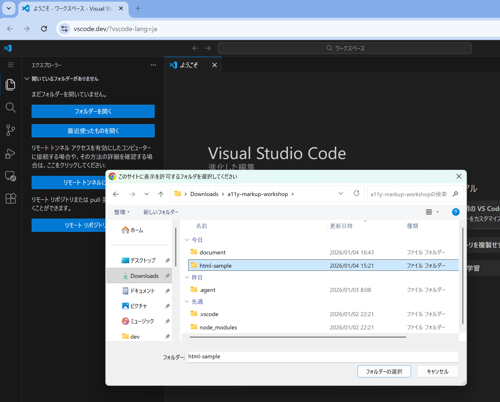
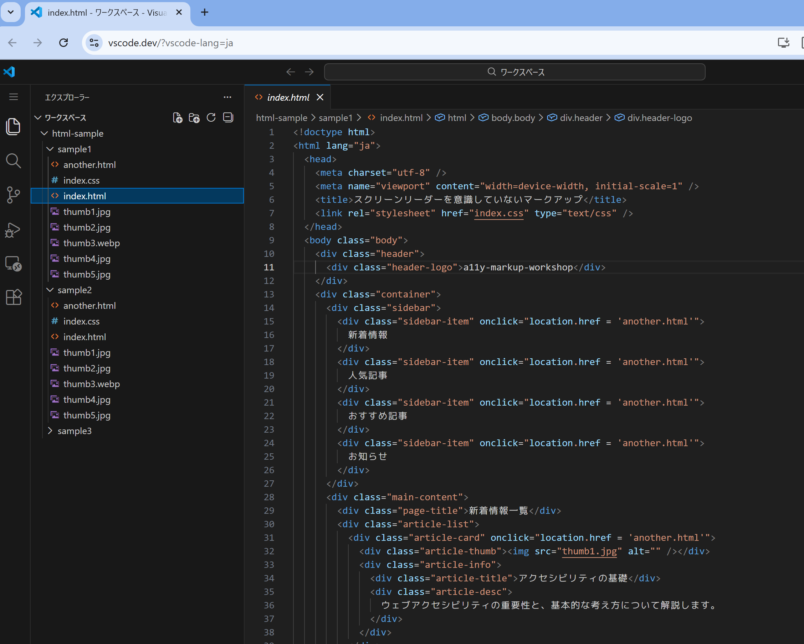
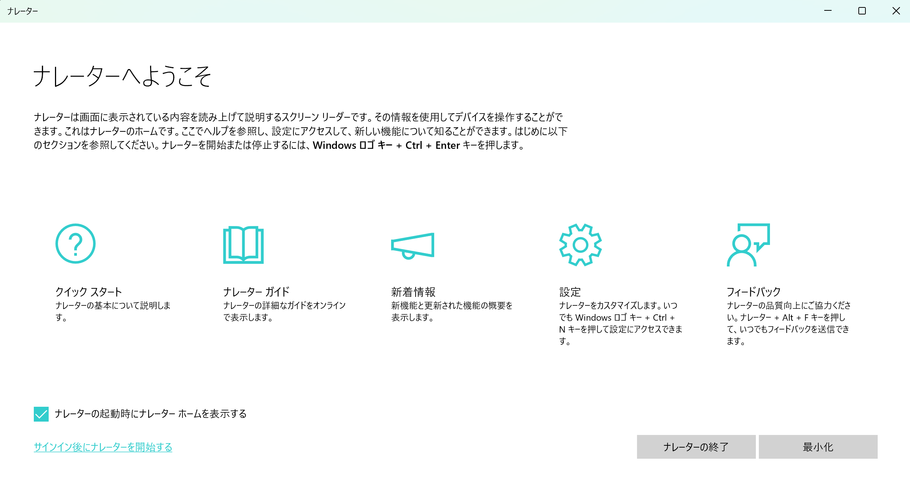

# アクセシビリティ勉強会 第3回 ～スクリーンリーダーを意識したマークアップ～

---

# 事前準備 / 1. 資料をダウンロードする

1. ゼロトラPCを使用します。
1. a11y-markup-workshop.zipをダウンロードします。
1. ダウンロードフォルダの中に解凍します

---

# 事前準備 / 2. VSCodeでフォルダーを開く

1. Edgeブラウザのアドレスバーに、`vscode.dev` と入力します。
1. 「フォルダーを開く」で、a11y-markup-workshop/html-sampleを選択します。
   
1. 左側のファイルブラウザで、sample1/index.htmlをクリックするとHTMLを編集できることを確認しておきます。

---

# 事前準備 / 3. エクスプローラでもフォルダーを開く

1. Windowsエクスプローラーで、a11y-markup-workshop/html-sampleを選択します。
1. sample1/index.htmlをダブルクリックするとブラウザで開けることを確認しておきます。
   

事前準備は以上です。

---

# スクリーンリーダーについて知ろう

- 日本視覚障害者 ICT ネットワーク (JBICT.Net) が毎年調査している。（2024年は219名対象）
- 視覚障害者の大半がPCとスマホでスクリーンリーダーを利用
- OSのシェアはWindowsが圧倒的に多い (全盲で99%、ロービジョンで94%)
  - Macは支援技術が充実していないので使われていない

---

# Windows用のスクリーンリーダーアプリケーション TOP3

- PC-Talker（有料） 74.64%
- NVDA日本語版（無料） 57.89%
- Windowsナレーター（Windows標準） 49.76%

用途により組み合わせて使っている人が多い。

---

# WindowsナレーターをON/OFFしてみよう！

**Win + Ctrl + Enter**

ナレーターホームのウィンドウは「最小化」で閉じてOK。

もう一度Win+Ctrl+Enterを押すと、ナレーターを終了します。

---
